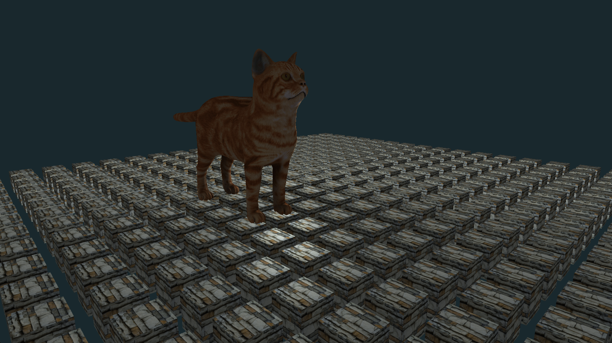
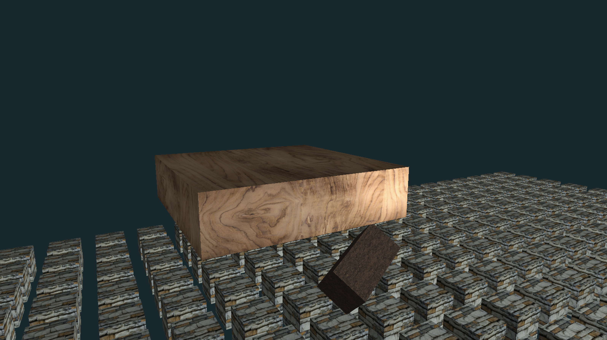

# 3D Graphics Engine in Python

Welcome to my **3D Graphics Engine** project! This is a custom-built graphics engine developed in Python with ModernGL and OpenGL, showcasing essential real-time rendering techniques, 3D object manipulation, and GPU-accelerated computations using GLSL shaders.

 *(Replace with a screenshot of your engine in action)*

## Features

- **Real-time rendering** of 3D objects with transformations.
- **Texturing** with support for mipmapping to maintain visual quality across various distances.
- **Phong lighting** for realistic shading and rendering.
- **Gamma correction** for accurate color representation.
- **.obj file loader** to import 3D models.
- **Custom camera controls** for navigation.
- **GLSL shaders** for efficient lighting computations directly on the GPU.

## Table of Contents

- [Getting Started](#getting-started)
- [Usage](#usage)
- [Features](#features)
- [Examples](#examples)

## Getting Started

### Prerequisites

Make sure you have Python 3 installed. This engine depends on the following packages:

- [ModernGL](https://pypi.org/project/ModernGL/)
- [PyOpenGL](https://pypi.org/project/PyOpenGL/)
- [NumPy](https://pypi.org/project/numpy/)

You can install all necessary packages using the requirements file:

```bash
pip install -r requirements.txt
```

### Installation

1. **Clone the repository**:

   ```bash
   git clone https://github.com/your-username/3d-graphics-engine.git
   cd 3d-graphics-engine
   ```

2. **Run the main script**:

   ```bash
   python main.py
   ```

*Note: Ensure that your machine supports OpenGL 3.3 or higher.*

## Usage

The engine allows you to load `.obj` files and apply textures, lighting, and transformations.

### Camera Controls
- **WASD** - Move the camera.
- **Mouse Movement** - Rotate the camera.

### Shaders
This project uses GLSL shaders for optimized lighting calculations, allowing dynamic lighting updates and realistic effects.

## Examples

Below is a example of what the engine can render:

1. **Textured Cube and Phong Lighting**  
   

## Features Breakdown

- **Texturing and Mipmaps**: Adds realism by scaling textures based on distance, improving performance and visual quality.
- **Phong Lighting Model**: Provides ambient, diffuse, and specular lighting effects for a realistic appearance.
- **Gamma Correction**: Ensures accurate color representation across different devices.
- **Camera Controls**: Intuitive camera controls.

## Project Structure

```plaintext
3d-graphics-engine/
├── objects/            # Stores .obj models and texture images
├── shaders/            # Contains GLSL shaders for rendering
├── textures/           # Stores textures for 3D base models
├── src/                # Source code for the engine
│   ├── camera.py       # Camera controls and setup
│   ├── light.py        # Light class and parameters
│   ├── mesh.py         # 3D Mesh representation in the 3D graphics OpenGL engine
│   ├── model.py        # 3D Base models implementation
│   ├── scene.py        # 3D Scene implementation in the 3D graphics OpenGL engine
│   ├── shader_program.py # Manage shader programs in the OpenGL context
│   ├── texture.py      # Manage texture loading and processing
│   ├── vao.py          # Vertex Array Object (VAO) representation
│   ├── vbo.py          # Manage Vertex Buffer Objects (VBO) for different 3D models
├── main.py             # Main entry point to run the engine
└── README.md           # Project documentation
└── requirements.txt    # List of the required python packages
```